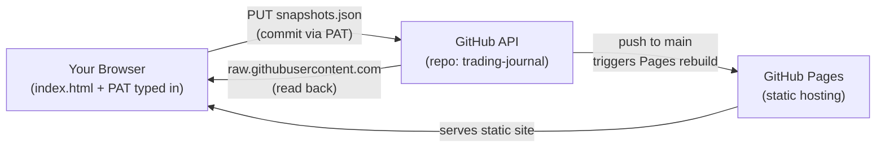
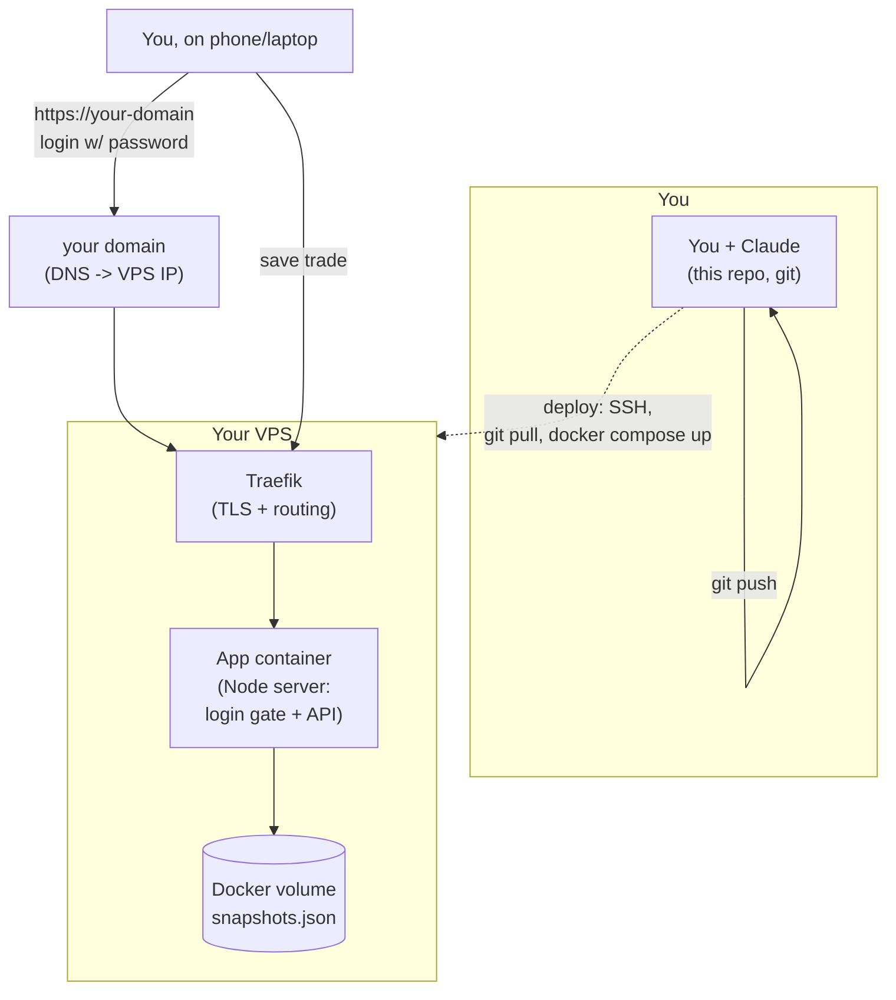

# Trading Journal

A small trading journal: log simple and hedged/options positions, auto-calculate
risk and R:R, fetch live spot prices, and keep a dated history of snapshots.

Runs as a self-hosted app: a small Node/Express backend serves the frontend,
gates it behind a shared password, and persists your data to a file on disk
(backed by a Docker volume in production) — no GitHub token typed into the
browser, no "save = git commit".

## How it used to work vs. how it works now

**Old way** (GitHub Pages + a Personal Access Token typed into the browser):



**New way** (self-hosted on a VPS, Docker + Traefik):



Saving now goes browser → your own Node API → a real file on a Docker volume,
instead of a GitHub commit. Going live is a manual "deploy" step (SSH in,
pull, rebuild) instead of waiting on a GitHub Pages rebuild.

## Local development

```bash
npm install
cp .env.example .env      # then edit .env: set APP_PASSWORD, SESSION_SECRET
npm start                 # node server.js
```

Open `http://localhost:3000/login.html`, log in with the password you put in
`.env`, and iterate — changes to `public/index.html` are served immediately
on refresh, no build step. Data is written to `./data/snapshots.json`
(git-ignored), seeded from the committed `snapshots.json` the first time it
runs.

Run the test suite (unchanged, covers the calculation logic in `logic.js`):

```bash
npm test
```

### Try it in Docker locally

```bash
docker compose -f docker-compose.yml -f docker-compose.local.yml up --build
```

`docker-compose.local.yml` is for local testing only — it exposes the app on
`http://localhost:3000` directly, since there's no local Traefik to route
through. It's deliberately **not** named `docker-compose.override.yml`:
Compose auto-merges any file with that name by default, which on a real
server would silently publish port 3000 straight onto the public internet
alongside (and bypassing) Traefik. Always pass it explicitly with `-f`, and
never rename it back.

On the VPS, always run plain `docker compose ...` (no `-f` flags) so only
`docker-compose.yml` — routed through Traefik — is used.

## First-time VPS deploy (one-time setup)

This app has never been deployed to your VPS before. Do this once:

1. **SSH into your VPS** and clone the repo:
   ```bash
   ssh <your-user>@<vps-ip>
   git clone <this-repo-url> /opt/trading-journal
   cd /opt/trading-journal
   ```
2. **Create `.env` on the VPS** (never commit this file):
   ```bash
   cp .env.example .env
   # edit .env: set a real APP_PASSWORD and a random SESSION_SECRET
   openssl rand -hex 32   # use this to generate SESSION_SECRET
   ```
3. **Traefik setup** — already confirmed against this VPS's actual Traefik
   container (`/docker/traefik`), no edits needed: it runs with
   `network_mode: host` and Docker-socket discovery, so no shared external
   network is required; entrypoint is `websecure`, cert resolver is
   `letsencrypt`. `docker-compose.yml`'s labels already match. Only edit the
   `Host(...)` rule if the domain isn't `changjulian.cloud`.
4. **Start it:**
   ```bash
   docker compose up -d --build
   ```
5. **Point your domain at the VPS**: update the domain's DNS A record to the
   VPS's IP address (replacing wherever it pointed before, e.g. GitHub
   Pages). Once you've confirmed traffic is flowing to the VPS, remove the
   `CNAME` file from this repo if it's no longer needed.
6. **Verify:**
   ```bash
   docker compose ps                        # container healthy?
   curl http://localhost:3000/healthz        # on the VPS
   curl -I https://your-domain/              # from anywhere else
   ```

## Routine deploys (after the one-time setup above)

Merging a PR to `main` deploys automatically — see "Automatic deploy on
merge" below. This is what that automation does under the hood (and what to
run by hand if you ever need to bypass it):

```bash
# 1. push your changes to this repo (already done if you're reading a merged PR)
# 2. on the VPS:
cd /opt/trading-journal
git fetch origin && git checkout main && git pull
docker compose build && docker compose up -d
docker compose logs --tail=50 trading-journal   # sanity check
```

## Automatic deploy on merge

`.github/workflows/deploy.yml` runs the steps above over SSH, on GitHub's
runners, every time `main` gets a new push (i.e. every merged PR) — or
on-demand via the *Run workflow* button on the Actions tab.

**One-time setup** — add these as repo secrets (Settings → Secrets and
variables → Actions):

| Secret        | Value                                                              |
|---------------|---------------------------------------------------------------------|
| `VPS_HOST`    | VPS IP or hostname                                                   |
| `VPS_USER`    | SSH user to deploy as                                                |
| `VPS_SSH_KEY` | Private half of an SSH key pair, whose public half is authorized on the VPS for `VPS_USER` (`~/.ssh/authorized_keys`) |
| `VPS_PORT`    | *(optional)* SSH port, if not 22                                     |

Use a dedicated deploy key, not your personal one — put its public key only
in that user's `authorized_keys` on the VPS, scoped to what it needs.

The workflow assumes the VPS deploy path is `/opt/trading-journal` on
branch `main` (matches the setup above). First connection trusts the host
key automatically (`StrictHostKeyChecking=accept-new`) and pins it for
future runs.

The data volume is untouched by this — your journal entries survive every
redeploy.

**Never run `docker compose down -v`** — the `-v` flag deletes the named
volume along with your data.

## Data safety

- **First boot**: if the data volume is empty, the app seeds itself from the
  committed `snapshots.json` — your existing history carries over
  automatically.
- **Backups**: every save copies the previous state into `data/backups/`
  before writing (last 30 kept). To restore one, copy it over
  `data/snapshots.json` and restart the container.
- **Code rollback**: `git checkout <previous commit>` on the VPS, then
  rebuild — the data volume is independent of the code, so this is safe to
  do repeatedly.
- **Manual export**: to pull a copy of the live data off the VPS:
  ```bash
  docker run --rm -v trading-journal-data:/data -v $(pwd):/backup alpine \
    cp /data/snapshots.json /backup/snapshots-manual-$(date +%F).json
  ```

## Environment variables

See `.env.example` for the full list: `APP_PASSWORD`, `SESSION_SECRET`,
`DATA_DIR`, `PORT`, `COOKIE_SECURE`.
